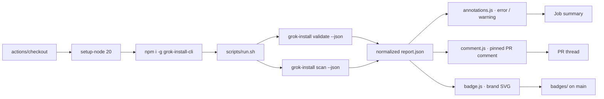

<!-- NEON / CYBERPUNK REPO TEMPLATE · GROK-INSTALL-ACTION -->

<p align="center">
  
</p>

<h1 align="center">⚡ grok-install-action</h1>

<p align="center">
  <b>Validate <code>.grok/</code> agents, run the safety scanner, post inline PR annotations, and generate a Grok-Native Certified badge — on every push and pull request.</b>
</p>

<p align="center">
  
</p>

<p align="center">
  <a href="https://github.com/AgentMindCloud/grok-install-action/actions/workflows/test.yml"></a>
  <a href="https://github.com/marketplace/actions/grokinstall-validate-scan"></a>
  <a href="https://github.com/AgentMindCloud/grok-install-action/releases"></a>
  <a href="./LICENSE"></a>
  <a href="https://nodejs.org/"></a>
  <a href="https://www.conventionalcommits.org/"></a>
</p>

<p align="center">
  <a href="https://grokagents.dev">
    
  </a>
</p>

---

## ✦ What It Does

<table>
  <tr>
    <td width="25%">
      <h3>✅ Validate</h3>
      <p>Schema check against the 14 YAML specs on every push.</p>
    </td>
    <td width="25%">
      <h3>🛡️ Scan</h3>
      <p>Safety + permissions audit with a numeric score (0–100).</p>
    </td>
    <td width="25%">
      <h3>📝 Annotate</h3>
      <p>Inline <code>::error</code> / <code>::warning</code> on the Files Changed tab.</p>
    </td>
    <td width="25%">
      <h3>💬 Pin + Certify</h3>
      <p>Single pinned PR comment (no spam) + brand-colored SVG badge.</p>
    </td>
  </tr>
</table>

> ⚠️ **Auto-Post-to-X is deferred to v2.** This action does not post to X.

## ✦ Quick Start

Drop this into `.github/workflows/grokinstall.yml`:

```yaml
name: GrokInstall

on:
  pull_request:
  push:
    branches: [main]

permissions:
  contents: write        # use 'read' if update-badge:false
  pull-requests: write
  checks: write

jobs:
  grokinstall:
    runs-on: ubuntu-latest
    steps:
      - uses: actions/checkout@v4
      - uses: AgentMindCloud/grok-install-action@v1
```

### One-liner install

```bash
mkdir -p .github/workflows && curl -fsSL \
  https://raw.githubusercontent.com/AgentMindCloud/grok-install-action/v1/workflows-examples/basic.yml \
  -o .github/workflows/grokinstall.yml
```

<table>
  <tr>
    <td width="33%">
      <h3>📄 basic.yml</h3>
      <p>Minimal single-agent repo.</p>
      <a href="./workflows-examples/basic.yml">Example →</a>
    </td>
    <td width="33%">
      <h3>🧮 matrix.yml</h3>
      <p>Multi-agent monorepo fan-out.</p>
      <a href="./workflows-examples/matrix.yml">Example →</a>
    </td>
    <td width="33%">
      <h3>🚀 release.yml</h3>
      <p>Gate on release tags.</p>
      <a href="./workflows-examples/release.yml">Example →</a>
    </td>
  </tr>
</table>

## ✦ How It Works



The PR-comment marker is `<!-- grokinstall-action:pr-comment -->` — swap it per-agent if you want matrix jobs to post separate comments instead of fighting over one.

**Pinned dependencies:** Node 20 · `@actions/core@1.10.1` · `@actions/github@6.0.0` · `@octokit/rest@20.1.1` · composite steps reference each script by absolute path under `${{ github.action_path }}`.

## ✦ What's New in v1.0

<table>
  <tr>
    <td width="50%">
      <h3>🛒 Marketplace Launch</h3>
      <p>Listed as <b>GrokInstall Validate & Scan</b>. See <code>marketplace.yml</code>.</p>
    </td>
    <td width="50%">
      <h3>📌 CLI Version Pinned</h3>
      <p><code>cli-version</code> defaults to <code>2.14.0</code> (was <code>latest</code>) for supply-chain reproducibility. <a href="./docs/cli-version-pinning.md">Override syntax →</a></p>
    </td>
  </tr>
  <tr>
    <td>
      <h3>🎨 visuals-preview Input</h3>
      <p>Opt-in, default <code>false</code>. On <code>cli-version >= 2.14.0</code> the CLI renders an HTML preview, URL surfaced in PR comment + <code>visuals-preview-url</code> output.</p>
    </td>
    <td>
      <h3>🏷️ Release Automation</h3>
      <p>Tag-triggered <code>release.yml</code> cuts a GitHub Release from <code>CHANGELOG.md</code> and force-moves the floating <code>v1</code> major-version tag.</p>
    </td>
  </tr>
  <tr>
    <td colspan="2">
      <h3>📋 Community Health Files</h3>
      <p><code>CONTRIBUTING.md</code>, <code>CHANGELOG.md</code>, <code>CODE_OF_CONDUCT.md</code>, <code>CODEOWNERS</code>, <code>FUNDING.yml</code>, issue forms, and a PR template.</p>
    </td>
  </tr>
</table>

## ✦ Inputs

| Name | Default | Description |
| --- | --- | --- |
| `working-directory` | `.` | Path to the repo root containing `.grok/` (or a sub-directory for monorepos). |
| `mode` | `strict` | `strict` fails the job on errors. `warn` annotates only, never fails. |
| `cli-version` | `2.14.0` | `grok-install-cli` version to install (any npm dist-tag or semver). Floor: `>= 2.0.0`. See [`docs/cli-version-pinning.md`](./docs/cli-version-pinning.md). |
| `visuals-preview` | `false` | Forward `--visuals-preview` to the CLI and surface the rendered URL. Requires `cli-version >= 2.14.0`. |
| `update-badge` | `true` | Generate `/badges/grok-native-certified.svg` and commit it on `main` pushes. |
| `comment-on-pr` | `true` | Post / update a PR comment with the report. |
| `github-token` | _(empty — falls back to `github.token`)_ | Token for PR comments + badge commit. Pass a PAT only if you need elevated scopes. |

## ✦ Outputs

| Name | Description |
| --- | --- |
| `passed` | `true` when validate + scan both succeeded. |
| `safety-score` | Numeric safety score 0–100. |
| `report-path` | Absolute path to the generated `report.json`. |
| `badge-path` | Repo-relative path to the SVG badge (when `update-badge: true`). |
| `visuals-preview-url` | URL of the rendered visuals preview (when `visuals-preview: true` on `cli-version >= 2.14.0`). Empty string otherwise. |

## ✦ Embed the Badge

After the first run on `main`, embed the badge in your README:

```markdown
[](https://grokagents.dev)
```

Or use a shields.io endpoint (auto-updates from your last run):

```markdown

```

### Brand tokens for custom badges

| Token | Value | Preview |
|---|---|---|
| Background | `#0A0D14` |  |
| Primary (cyan) | `#00E5FF` |  |
| Accent (violet) | `#7C3AED` |  |
| Highlight (magenta) | `#FF4FD8` |  |
| Danger | `#FF2D55` |  |

## ✦ Permissions

Minimum token scopes — see [SECURITY.md](./SECURITY.md) for detail.

| Scope | Needed for | Required when |
| --- | --- | --- |
| `contents: read` | checkout + cli runs | always |
| `contents: write` | commit `/badges/*.svg` back to `main` | `update-badge: true` |
| `pull-requests: write` | post / update PR comment | `comment-on-pr: true` |
| `checks: write` | render `::error` / `::warning` annotations | always |

## ✦ Local Development

```bash
npm ci
npm test                   # runs tests/unit.test.js against fixture reports
```

Integration test (what CI runs):

```bash
# Self-test uses the bundled sample agent
grok-install validate tests/sample-agent
grok-install scan     tests/sample-agent
```

CI wires the same flow end-to-end via [`.github/workflows/test.yml`](./.github/workflows/test.yml), invoking the action against `tests/sample-agent` in `mode: warn`.

See [`CONTRIBUTING.md`](./CONTRIBUTING.md) for PR guidelines and [`CHANGELOG.md`](./CHANGELOG.md) for release history.

## ✦ Sibling Repos

<table>
  <tr>
    <td width="33%">
      <h3>📦 grok-install</h3>
      <p>The universal spec this action validates.</p>
      <a href="https://github.com/agentmindcloud/grok-install">Repository →</a>
    </td>
    <td width="33%">
      <h3>⚙️ grok-install-cli</h3>
      <p>The CLI this action wraps. Shipped together.</p>
      <a href="https://github.com/agentmindcloud/grok-install-cli">Repository →</a>
    </td>
    <td width="33%">
      <h3>🌟 awesome-grok-agents</h3>
      <p>10 certified templates you can validate with this action.</p>
      <a href="https://github.com/agentmindcloud/awesome-grok-agents">Repository →</a>
    </td>
  </tr>
</table>

## ✦ Connect

<p align="center">
  <a href="https://github.com/agentmindcloud">
    
  </a>
  <a href="https://x.com/JanSol0s">
    
  </a>
  <a href="https://grokagents.dev">
    
  </a>
</p>

## ✦ License

Apache 2.0. See [LICENSE](./LICENSE).

<br/>

<p align="center">
  <sub>Powered by <b>GrokInstall</b> · <a href="https://grokagents.dev">grokagents.dev</a></sub>
</p>

<p align="center">
  <sub><i>GrokInstall is an independent community project. Not affiliated with xAI, Grok, or X.</i></sub>
</p>

<p align="center">
  
</p>
